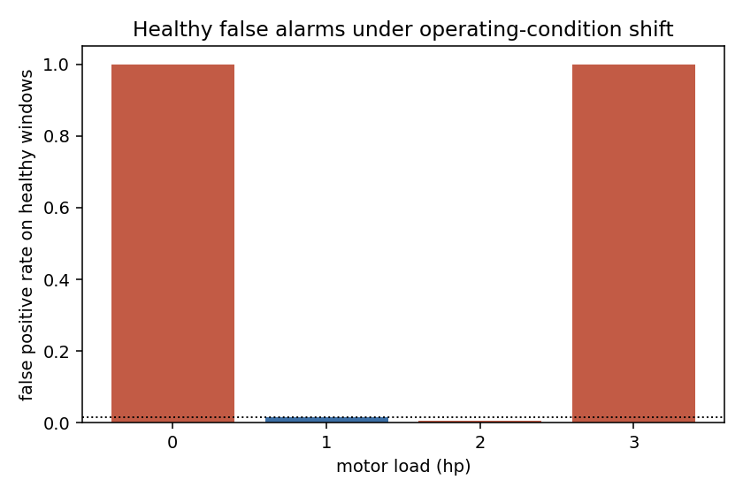

# Unsupervised bearing fault detection under operating-condition shift

An autoencoder trained **only on healthy vibration data from a single motor load**,
used to flag rolling-element bearing faults by reconstruction error, on the CWRU
12 kHz drive-end dataset.

Detecting seeded faults on CWRU is not the interesting part — the classes are
close to linearly separable and a scalar kurtosis threshold already gets most of
the way there. This repository is set up to measure the part that actually
decides whether an unsupervised detector is deployable: **does the decision
threshold survive a change in operating condition it was never calibrated on?**

## Protocol

1. Split the healthy windows recorded at **one** motor load (1 hp by default)
   three ways: train, calibrate, test. No faulty window is seen during training.
2. Fix the anomaly threshold at the 99th percentile of reconstruction error on
   the **calibration** split. Fault labels are never used to select it. The
   healthy **test** split is touched by neither training nor calibration, so the
   false-alarm rate at the training load is an independent measurement rather
   than a restatement of the quantile that defined the threshold.
3. Score faults at the training load — the easy, usually-reported case.
4. Score healthy **and** faulty data at the three unseen loads (0, 2, 3 hp), and
   report the false-alarm rate on healthy data at each load separately.
5. Run the same protocol with a spectral-kurtosis-style scalar detector, so the
   autoencoder has an honest baseline to beat rather than being reported alone.

Labels enter the pipeline only in steps 3–5, for scoring.

## Results

Dense autoencoder over log spectra, trained on 564 healthy windows at 1 hp.
Threshold set at the 99th percentile of reconstruction error on 187 healthy
calibration windows; a further 187 healthy windows were held out from both
training and calibration and used only for the false-alarm measurement below.

| | 1 hp (training load) | unseen loads (0, 2, 3 hp) |
|---|---|---|
| ROC-AUC, autoencoder | 1.000 | 1.000 |
| True positive rate @ fixed threshold | 1.000 | 1.000 |
| **False positive rate on healthy data** | **0.016** | **0.603** |
| ROC-AUC, kurtosis baseline | 0.863 | 0.860 |
| True positive rate, kurtosis baseline | 0.712 | 0.690 |
| False positive rate, kurtosis baseline | 0.011 | 0.012 |

False alarms on healthy data, by motor load:

| load | 0 hp | 1 hp (trained) | 2 hp | 3 hp |
|---|---|---|---|---|
| false positive rate | 1.000 | 0.016 | 0.005 | 1.000 |



Two things are worth drawing out.

**The ranking is perfect everywhere; the calibration is not.** ROC-AUC is 1.000 at
every operating condition, so reconstruction error separates damaged from healthy
windows without exception. A threshold-free evaluation would report a flawless
detector. Fixing the threshold on healthy data at one load and applying it
elsewhere produces false alarms on 60% of healthy windows. AUC is measuring
something the deployed system does not get to use.

**Transfer is not a smooth function of operating distance.** The threshold holds at
2 hp (0.5% false alarms) and collapses at 0 hp and 3 hp (100%). This is not
ordered by shaft speed: 0 hp is nearer the training condition in rpm than 2 hp is,
and at this window length the speed differences fall below one spectral bin in any
case. Whatever separates the transferable conditions from the non-transferable
ones is not the operating point, which means the operating point cannot be used to
decide when the detector is trustworthy.

**The scalar baseline inverts the trade-off.** Kurtosis detects far less (71% of
faults against 100%) but its calibration barely moves under shift — 1.1% to 1.2%
false alarms. Neither method dominates: the autoencoder is the better detector and
the worse alarm, and any deployment would have to choose between missed faults and
ignored alarms, or re-calibrate per operating regime.

## Running it

```bash
pip install -r requirements.txt
python -m src.main --config configs/dense_logspec.yaml --out results
python -m src.main --config configs/conv_raw.yaml --out results_conv
```

Point `data.roots` in the config at a directory containing the CWRU `.mat`
files. The loader walks it recursively and handles both the original numeric
file names (`97.mat`, `105.mat`) and the descriptive ones used by most public
mirrors (`Normal_0.mat`, `IR007_1.mat`, `OR007@6_2.mat`). Set `data.exclude` to
keep a single sampling rate — several mirrors ship the 48 kHz drive-end
recordings next to the 12 kHz ones, and mixing sampling rates silently corrupts
every spectral feature.

Everything that affects a result lives in the YAML config, including the seed.
`notebooks/kaggle_run.ipynb` runs the same code on Kaggle against a mounted CWRU
dataset.

## Design choices worth arguing with

- **Healthy and faulty recordings are brought to a common sampling rate first.**
  CWRU records the healthy baseline at 48 kHz and the drive-end faults at 12 kHz,
  and stores the rate nowhere in the files. Left alone, the autoencoder separates
  the two classes on sampling rate rather than on damage, and reports a near
  perfect score for the wrong reason. Everything is resampled to 12 kHz before
  any feature is computed, and the resolved rate and resulting duration are
  printed for every run so the assumption can be checked rather than trusted.
- **Windows are RMS-normalised before featurisation.** Without this, the model
  can separate healthy from faulty on overall vibration energy alone, and the
  reported numbers say nothing about whether the autoencoder learned structure.
- **Training uses the 1 hp baseline, not 0 hp.** The 0 hp healthy recording is
  roughly five seconds long. Fitting an autoencoder to the few dozen windows it
  yields produces a model that has memorised its training set, and every
  subsequent number is an artifact of that rather than a property of the method.
- **The bottleneck is small (8 units).** A wide bottleneck approaches the
  identity function and reconstructs faults as accurately as healthy data,
  which quietly destroys the detector.
- **The threshold is a quantile of healthy validation error**, not the value
  that maximises accuracy on the test set. Tuning it against labels would make
  the method supervised while still calling itself unsupervised — a common
  failure in published CWRU results.

## What this does not show

- CWRU faults are **seeded by electro-discharge machining**, not grown in
  service. They are more localised and more visible than real spalling. Nothing
  here demonstrates early-stage or progressive damage detection; NASA's IMS
  run-to-failure set is the right follow-up for that.
- One test rig, one bearing type, one fault-injection method. No claim of
  cross-machine generalisation.
- No physics is used. Bearing characteristic frequencies (BPFO/BPFI/BSF) are
  computable from geometry and shaft speed here, and an envelope-spectrum
  detector built on them is the correct engineering baseline. It is not
  implemented in this repository.
- Healthy data is scarce. A single CWRU baseline recording is 5-10 s, which
  after windowing leaves a few hundred training windows with heavy overlap
  between them. They are not independent samples, and the model remains
  overparameterised relative to them.
- Two-hour project. The point was a clean protocol and an honest failure mode,
  not a state-of-the-art number.

## Data

Case Western Reserve University Bearing Data Center, 12 kHz drive-end fault data
and normal baseline data: <https://engineering.case.edu/bearingdatacenter>

## Licence

MIT.
